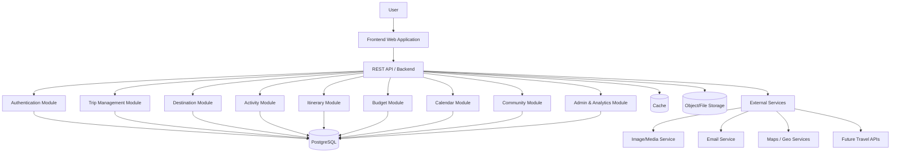

# Architecture

## 1. Architecture Overview

GlobeTrotter will use a **modular monolithic client-server architecture** designed for a web-based travel planning platform.

The architecture separates the frontend, backend application, business logic, database, file storage, and external services while keeping the initial deployment simple and cost-effective.

The system will be designed so that individual modules remain logically separated even though they run within the same backend application. This allows the application to start as a monolith and evolve toward independently scalable services when required.

### High-Level Architecture



---

# 2. Architectural Goals

The architecture is designed around the following goals:

### Maintainability

The system should be divided into clear modules so that changes to one feature do not unnecessarily affect unrelated modules.

### Simplicity

The first release should avoid unnecessary distributed-system complexity.

### Performance

Frequently accessed data should be efficiently queried, cached where appropriate, and returned through optimized APIs.

### Security

Authentication, authorization, validation, and protection of user data must be enforced at the backend.

### Scalability

The application should be capable of handling increasing numbers of users, trips, destinations, activities, and community records.

### Reusability

Common services such as validation, authentication, file uploads, pagination, filtering, and error handling should be reusable across modules.

### Extensibility

The architecture should make it possible to add future functionality such as AI recommendations, booking integrations, maps, and collaborative planning.

### Data Integrity

Relationships between users, trips, destinations, itinerary items, activities, and expenses must be maintained using relational database constraints.

---

# 3. System Architecture

GlobeTrotter will use a layered modular architecture.

```text
                         ┌──────────────────────────┐
                         │          USERS           │
                         └────────────┬─────────────┘
                                      │
                                      ▼
                         ┌──────────────────────────┐
                         │     FRONTEND CLIENT      │
                         │  React / Next.js / Web   │
                         └────────────┬─────────────┘
                                      │ HTTPS / REST
                                      ▼
                    ┌─────────────────────────────────────┐
                    │          BACKEND APPLICATION        │
                    │         Modular Monolith            │
                    │                                     │
                    │ ┌─────────┐ ┌─────────┐ ┌────────┐ │
                    │ │  Auth   │ │  Trips  │ │ Cities │ │
                    │ ├─────────┤ ├─────────┤ ├────────┤ │
                    │ │Activity │ │Itinerary│ │ Budget │ │
                    │ ├─────────┤ ├─────────┤ ├────────┤ │
                    │ │Calendar │ │Community│ │ Admin  │ │
                    │ └─────────┘ └─────────┘ └────────┘ │
                    └──────────────┬───────────┬─────────┘
                                   │           │
                         ┌─────────┘           └──────────┐
                         ▼                                ▼
                ┌─────────────────┐             ┌─────────────────┐
                │   PostgreSQL    │             │ Object Storage  │
                │  Relational DB  │             │ Images / Media  │
                └─────────────────┘             └─────────────────┘
                         │
                         ▼
                ┌─────────────────┐
                │      Cache      │
                │ Redis-compatible│
                └─────────────────┘
```

### Main Components

1. **Frontend Client**

   * User interface.
   * Navigation.
   * Forms.
   * Search.
   * Itinerary interactions.
   * Calendar.
   * Charts.
   * Community interface.
2. **Backend Application**

   * REST APIs.
   * Authentication.
   * Authorization.
   * Business rules.
   * Validation.
   * Module orchestration.
   * Database access.
3. **PostgreSQL**

   * Primary persistent data store.
   * Users.
   * Trips.
   * Destinations.
   * Activities.
   * Itineraries.
   * Expenses.
   * Community records.
4. **Object Storage**

   * Profile images.
   * Trip cover images.
   * Destination images.
   * Activity images.
   * Other uploaded media.
5. **Cache**

   * Frequently accessed destination data.
   * Popular cities.
   * Popular activities.
   * Dashboard summaries.
   * Session or temporary data where appropriate.
6. **External Services**

   * Email.
   * Image/media processing.
   * Maps.
   * Future travel APIs.

---

# 4. Architecture Style

## Monolith / Modular Monolith / Microservices

**Selected Architecture: Modular Monolith**

The initial backend will be deployed as one application while maintaining strong internal module boundaries.

### Why Modular Monolith?

A modular monolith provides:

* Lower infrastructure complexity.
* Easier development and deployment.
* Lower operational cost.
* Faster initial development.
* Easier database transactions.
* Clear separation of application modules.
* A migration path toward microservices if the platform grows significantly.

The architecture should avoid tightly coupling modules even though they run within the same process.

### Future Migration

Modules such as:

* Search
* Community
* Recommendation engine
* Analytics
* Notification processing

could later become independent services if scale requires it.

---

## REST / GraphQL

**Selected API Style: REST**

REST will be used for the initial application API.

### Reasons

* Simple to implement.
* Easy to test.
* Well suited for CRUD operations.
* Suitable for frontend applications.
* Easy to document.
* Works well with standard HTTP caching mechanisms.

Example:

```text
GET    /api/v1/trips
POST   /api/v1/trips
GET    /api/v1/trips/:id
PUT    /api/v1/trips/:id
DELETE /api/v1/trips/:id

GET    /api/v1/destinations
GET    /api/v1/activities
POST   /api/v1/trips/:id/itinerary
GET    /api/v1/trips/:id/budget
```

GraphQL may be considered later if the application requires highly dynamic data aggregation.

---

## Client-Server

**Selected Architecture: Client-Server**

The frontend communicates with the backend through secure HTTP/HTTPS API requests.

```text
Browser
   │
   │ HTTPS
   ▼
REST API
   │
   ▼
Business Logic
   │
   ▼
Database
```

---

## SaaS / Single Tenant / Multi Tenant

**Selected Model: Multi-user SaaS Application**

GlobeTrotter will support multiple independent users within the same application.

Each user's private data will be logically isolated using ownership relationships.

Example:

```text
User A
 ├── Trip A1
 ├── Trip A2
 └── Trip A3

User B
 ├── Trip B1
 └── Trip B2
```

A user must never be able to access another user's private trip data.

The initial system does not require organization-level tenant isolation.

---

# 5. Technology Stack

## Frontend

Recommended:

* **React / Next.js**
* TypeScript
* Responsive CSS / Tailwind CSS
* React-based component architecture
* Client-side state management where required
* REST API integration
* Form validation library
* Chart library for analytics/budget visualizations

### Frontend Responsibilities

* Render UI.
* Manage user interactions.
* Validate basic form input.
* Call backend APIs.
* Manage UI state.
* Display loading and error states.
* Handle responsive layouts.

The frontend must not contain sensitive business logic or database credentials.

---

## Backend

Recommended:

* **Node.js**
* **Express.js**
* TypeScript
* REST API
* ORM/query layer
* Validation library
* Authentication middleware
* Authorization middleware

### Backend Responsibilities

* Business logic.
* Authentication.
* Authorization.
* Database operations.
* Validation.
* API responses.
* File upload coordination.
* Error handling.
* Analytics aggregation.
* Integration with external services.

---

## Database

**PostgreSQL**

PostgreSQL will act as the primary relational database.

### Main Data Domains

```text
Users
  │
  ├── Trips
  │     ├── Trip Stops
  │     ├── Itinerary Sections
  │     ├── Itinerary Items
  │     └── Expenses
  │
  ├── Preferences
  │
  └── Saved Destinations

Destinations
  └── Activities
        └── Categories

Community
  └── Shared Trips / Posts
```

PostgreSQL is preferred because GlobeTrotter contains many relationships and transactional operations.

---

## Storage

Object storage will be used for files and media rather than storing large binary files directly inside PostgreSQL.

Possible storage providers:

* Cloudflare R2
* AWS S3
* Supabase Storage
* Another S3-compatible object-storage provider

---

## Cache

**Redis-compatible cache**

A Redis-compatible service may be used for:

* Popular destinations.
* Popular activities.
* Dashboard aggregates.
* Search result caching.
* Temporary data.
* Rate limiting.
* Short-lived session-related data where applicable.

Caching should not replace PostgreSQL as the source of truth.

---

## Queue

A background-job system can be introduced when asynchronous work becomes necessary.

Possible technologies:

* Redis + BullMQ
* Cloud-managed queue
* Message broker

Initial implementation can operate without a dedicated queue if the workload is small.

---

## External Services

Potential integrations include:

* Email provider.
* Image storage.
* Image optimization service.
* Maps/geolocation API.
* Geocoding API.
* Weather API.
* Travel data APIs.
* Analytics/monitoring services.

External services should be wrapped behind internal service interfaces so that providers can be replaced later.

---

# 6. System Layers

## Presentation Layer

Responsible for communication with users.

### Includes

* Pages.
* Components.
* Forms.
* Navigation.
* Cards.
* Modals.
* Tables.
* Charts.
* Calendar.
* Client-side state.

### Does Not Include

* Database operations.
* Secret credentials.
* Critical business rules.

---

## Application Layer

Responsible for coordinating application use cases.

Examples:

```text
CreateTrip
UpdateTrip
AddDestinationToTrip
AddActivityToItinerary
CalculateTripBudget
PublishTrip
CopyPublicTrip
```

The application layer coordinates controllers, services, validation, and repositories.

---

## Business Logic Layer

Contains the actual rules of GlobeTrotter.

Examples:

* End date cannot occur before start date.
* Users can modify only trips they own.
* Public trips can be copied.
* Expenses cannot be negative.
* Activities must belong to valid itinerary contexts.
* Itinerary dates must remain within trip dates.

Business logic should not depend directly on the UI.

---

## Data Layer

Responsible for persistent data operations.

### Includes

* Database models.
* Repositories.
* Queries.
* Transactions.
* Migrations.
* Database constraints.
* Indexes.

The data layer communicates with PostgreSQL.

---

## Infrastructure Layer

Responsible for external technical services.

### Includes

* Object storage.
* Redis.
* Email service.
* Maps APIs.
* Logging.
* Monitoring.
* Background jobs.
* Deployment services.

---

# 7. Authentication Architecture

Authentication verifies the identity of a user.

### Authentication Flow

```text
User
  │
  ▼
Login Form
  │
  ▼
POST /auth/login
  │
  ▼
Authentication Service
  │
  ├── Find User
  ├── Verify Password
  └── Create Session / Token
  │
  ▼
Authenticated Client
```

### Registration Flow

```text
User
  │
  ▼
Registration Form
  │
  ▼
POST /auth/register
  │
  ▼
Validate Input
  │
  ▼
Hash Password
  │
  ▼
Create User
  │
  ▼
Return Authentication Result
```

### Recommended Security

* Password hashing using a secure password hashing algorithm.
* Secure HTTPS communication.
* Short-lived access tokens or secure sessions.
* Refresh mechanism where token-based authentication is used.
* Secure cookies where session-based authentication is used.
* Rate limiting for authentication endpoints.
* Password reset tokens with expiration.
* No passwords stored in plain text.

---

# 8. Authorization Architecture

Authorization determines what an authenticated user is allowed to access.

## Roles

### User

Can:

* Manage own profile.
* Create trips.
* Edit own trips.
* Delete own trips.
* Manage own itineraries.
* Publish eligible trips.
* Copy public trips.
* Interact with permitted community functionality.

### Administrator

Can:

* Access admin dashboard.
* View platform statistics.
* Manage users where permitted.
* Access administrative analytics.
* Manage platform-level functionality.

### Ownership-Based Authorization

Trip access should be validated using ownership.

```text
Request
   │
   ▼
Authenticate User
   │
   ▼
Identify Resource
   │
   ▼
Check Ownership / Permission
   │
   ├── Allowed → Continue
   │
   └── Denied → 403 Forbidden
```

A user should not be trusted simply because a trip ID is supplied in the request.

---

# 9. Data Flow

## Trip Creation

```text
Frontend
   │
   │ POST /trips
   ▼
Trip Controller
   │
   ▼
Input Validation
   │
   ▼
Trip Service
   │
   ▼
Trip Repository
   │
   ▼
PostgreSQL
   │
   ▼
Created Trip
   │
   ▼
API Response
   │
   ▼
Frontend State
```

## Adding an Activity

```text
Activity Search
      │
      ▼
GET /activities
      │
      ▼
Activity Service
      │
      ├── Cache (optional)
      │
      └── PostgreSQL
      │
      ▼
Search Results
      │
      ▼
User Selects Activity
      │
      ▼
POST /itinerary/items
      │
      ▼
Validate Trip Ownership
      │
      ▼
Validate Date / Destination
      │
      ▼
Create Itinerary Item
      │
      ▼
PostgreSQL
```

## Budget Calculation

```text
Trip
 │
 ├── Transport Expenses
 ├── Accommodation
 ├── Activities
 ├── Meals
 └── Miscellaneous
          │
          ▼
     Budget Service
          │
          ▼
   Total Calculation
          │
          ▼
      API Response
          │
          ▼
    Budget Dashboard
```

---

# 10. Module Interaction

The application will use modular boundaries.

## Authentication Module

Provides identity and authorization information to other modules.

```text
Auth
 ├── User
 ├── Session
 └── Authorization
```

## Trip Module

Acts as the central parent module for trip-related information.

```text
Trip
 ├── Stops
 ├── Itinerary
 ├── Budget
 └── Calendar
```

## Destination Module

Provides destination information to the trip and search modules.

## Activity Module

Provides activity information associated with destinations.

## Itinerary Module

Connects:

```text
Trip
  +
Destination
  +
Date
  +
Activity
  +
Expense
```

## Budget Module

Consumes expense information from itinerary and trip records.

## Calendar Module

Consumes itinerary and date data to create calendar representations.

## Community Module

Uses published trip information without exposing private trip data.

## Analytics Module

Reads aggregated system data for administrative reporting.

### Module Dependency Direction

```text
Presentation
      ↓
Application
      ↓
Business Modules
      ↓
Data Access
      ↓
PostgreSQL
```

Modules should avoid direct access to another module's internal implementation.

---

# 11. External Integrations

External integrations should be isolated behind service interfaces.

## Email

Possible uses:

* Welcome email.
* Password reset.
* Trip reminders.
* Account notifications.

## Maps / Geolocation

Possible uses:

* City lookup.
* Geocoding.
* Distance calculation.
* Map visualization.
* Route estimation.

## Weather

Future use:

* Destination weather.
* Trip-date weather.
* Weather alerts.

## Travel APIs

Future use:

* Flights.
* Hotels.
* Activities.
* Transportation.

## Image Services

Possible uses:

* Image storage.
* Image resizing.
* Compression.
* Thumbnail generation.

### Integration Principle

The application should not tightly couple business logic to one provider.

Example:

```text
Trip Service
     │
     ▼
WeatherService Interface
     │
     ├── Provider A
     ├── Provider B
     └── Mock Provider
```

This makes external services replaceable.

---

# 12. File Storage

Large media files should be stored outside PostgreSQL.

## Storage Flow

```text
User
 │
 ▼
Frontend
 │
 ▼
Upload API
 │
 ▼
Validation
 │
 ▼
Object Storage
 │
 ▼
Public/Signed File URL
 │
 ▼
PostgreSQL stores metadata + URL
```

### Stored Media

* User profile images.
* Trip cover images.
* Destination images.
* Activity images.
* Community media.

### File Rules

* Validate MIME type.
* Validate file size.
* Generate safe filenames.
* Avoid executable uploads.
* Resize/compress images where appropriate.
* Store file metadata in PostgreSQL.
* Use signed/private URLs for private content where required.

---

# 13. Background Jobs

Background jobs should be introduced for operations that do not need to block a user's request.

### Possible Jobs

* Image processing.
* Thumbnail generation.
* Email delivery.
* Trip reminder notifications.
* Analytics aggregation.
* Search indexing.
* Cache warming.
* Data cleanup.

### Background Job Flow

```text
Application
     │
     ▼
Job Queue
     │
     ▼
Worker
     │
     ├── Process Image
     ├── Send Email
     ├── Generate Analytics
     └── Update Cache
```

For the MVP, background jobs can remain limited to tasks where asynchronous processing provides a clear benefit.

---

# 14. Caching

Caching should be applied selectively.

## Good Cache Candidates

* Popular cities.
* Popular activities.
* Destination metadata.
* Activity metadata.
* Public/shared trip summaries.
* Dashboard aggregates.
* Frequently used search results.

## Cache Strategy

```text
Client
  │
  ▼
API
  │
  ▼
Cache
  │
  ├── HIT → Return Data
  │
  └── MISS
        │
        ▼
    PostgreSQL
        │
        ▼
    Store Cache
        │
        ▼
    Return Data
```

### Cache Rules

* Define expiration times.
* Invalidate cache when underlying data changes.
* Never rely on cache for permanent data.
* Do not cache sensitive private information unnecessarily.
* Monitor cache hit/miss rates.

---

# 15. Logging & Monitoring

## Application Logging

The backend should record:

* Server startup/shutdown.
* API requests.
* Errors.
* Authentication failures.
* Important administrative actions.
* Background job failures.

Sensitive information such as passwords and authentication secrets must never be logged.

## Monitoring

Monitor:

* Application uptime.
* API response time.
* Error rate.
* Database performance.
* CPU/memory usage.
* Cache performance.
* Background job failures.
* Storage usage.

## Error Tracking

A centralized error tracking service may be used to identify:

* Frontend exceptions.
* Backend exceptions.
* API failures.
* Production regressions.

---

# 16. Security Architecture

Security will follow a defense-in-depth approach.

## Application Security

* HTTPS everywhere.
* Secure authentication.
* Authorization checks.
* Input validation.
* Output validation where appropriate.
* Rate limiting.
* Secure headers.
* CORS configuration.
* CSRF protection where applicable.
* Secure cookie configuration where cookies are used.

## Database Security

* Database credentials stored in environment secrets.
* Least-privilege database access.
* Parameterized queries/ORM protections.
* Foreign-key constraints.
* Proper indexes.
* Regular backups.

## File Security

* File type validation.
* File size limits.
* Safe object names.
* No executable uploads.
* Access control for private files.

## API Security

* Authentication on protected endpoints.
* Authorization on resource access.
* Request validation.
* Rate limiting.
* Standardized error responses.
* Avoid leaking internal database errors.

## Privacy

Private user data must remain inaccessible to unauthorized users.

Public itinerary functionality must expose only information explicitly intended for public sharing.

---

# 17. Scalability

The initial architecture should support vertical scaling and basic horizontal scaling.

## Stage 1 — Initial Scale

```text
Frontend
   │
Backend Instance
   │
PostgreSQL
```

Suitable for early development and small-to-medium usage.

## Stage 2 — Increased Usage

```text
                ┌── Backend Instance 1
Load Balancer ──┼── Backend Instance 2
                └── Backend Instance 3
                         │
                         ▼
                     PostgreSQL
                         │
                       Redis
```

## Stage 3 — Advanced Scale

Individual high-load components can be separated:

```text
Frontend
   │
API Gateway
   │
   ├── Core Travel Service
   ├── Search Service
   ├── Community Service
   ├── Recommendation Service
   ├── Analytics Service
   └── Notification Service
```

### Scaling Priorities

1. Optimize database queries.
2. Add database indexes.
3. Add caching.
4. Optimize images.
5. Add pagination.
6. Add horizontal backend scaling.
7. Introduce background workers.
8. Separate high-load services only when necessary.

Microservices should not be introduced solely for architectural complexity.

---

# 18. Deployment Architecture

## Initial Deployment

```text
                    Internet
                       │
                       ▼
                ┌──────────────┐
                │   Frontend   │
                │   Hosting    │
                └──────┬───────┘
                       │
                    HTTPS
                       │
                       ▼
                ┌──────────────┐
                │   Backend    │
                │   Hosting    │
                └──────┬───────┘
                       │
              ┌────────┴─────────┐
              ▼                  ▼
       ┌─────────────┐    ┌─────────────┐
       │ PostgreSQL  │    │    Redis    │
       └─────────────┘    └─────────────┘
```

## Production Components

* Frontend hosting.
* Backend hosting.
* Managed PostgreSQL.
* Object storage.
* Redis-compatible cache.
* DNS.
* HTTPS/SSL.
* Monitoring.
* Backup system.

## Environment Separation

```text
Development
     │
     ▼
Staging / Testing
     │
     ▼
Production
```

Environment-specific secrets must not be committed to source control.

---

# 19. Project Folder Structure

A modular structure should be used for the backend.

## Repository

```text
globtrotter/
│
├── apps/
│   │
│   ├── frontend/
│   │   ├── public/
│   │   └── src/
│   │       ├── components/
│   │       ├── layouts/
│   │       ├── pages/
│   │       ├── routes/
│   │       ├── features/
│   │       ├── hooks/
│   │       ├── services/
│   │       ├── state/
│   │       ├── utils/
│   │       ├── types/
│   │       └── styles/
│   │
│   └── backend/
│       └── src/
│           ├── config/
│           ├── middleware/
│           ├── modules/
│           │   │
│           │   ├── auth/
│           │   │   ├── controller/
│           │   │   ├── service/
│           │   │   ├── repository/
│           │   │   ├── routes/
│           │   │   ├── validation/
│           │   │   └── types/
│           │   │
│           │   ├── users/
│           │   ├── trips/
│           │   ├── destinations/
│           │   ├── activities/
│           │   ├── itinerary/
│           │   ├── budget/
│           │   ├── calendar/
│           │   ├── community/
│           │   └── admin/
│           │
│           ├── database/
│           │   ├── migrations/
│           │   ├── seeds/
│           │   └── connection/
│           │
│           ├── integrations/
│           │   ├── storage/
│           │   ├── email/
│           │   ├── maps/
│           │   └── travel/
│           │
│           ├── jobs/
│           ├── utils/
│           ├── types/
│           └── app.ts
│
├── docs/
│   ├── 01-Planning/
│   │   ├── PRD.md
│   │   ├── Roadmap.md
│   │   └── TODO.md
│   │
│   ├── 02-Architecture/
│   │   ├── Architecture.md
│   │   ├── Database.md
│   │   ├── API.md
│   │   └── Modules.md
│   │
│   └── 03-Design/
│       ├── Design.md
│       ├── UI.md
│       ├── Navigation.md
│       └── Routes.md
│
├── .env.example
├── .gitignore
├── README.md
└── package.json
```

### Module Structure

Each backend module should follow a consistent structure:

```text
module/
├── controller/
├── service/
├── repository/
├── routes/
├── validation/
├── types/
└── tests/
```

### Responsibility

**Controller**

* Receives HTTP requests.
* Sends HTTP responses.
* Does not contain complex business logic.

**Service**

* Contains business rules.
* Coordinates module operations.

**Repository**

* Handles database access.

**Routes**

* Defines API endpoints.

**Validation**

* Validates request data.

**Types**

* Defines reusable TypeScript types/interfaces.

---

# 20. Future Architecture

The architecture should support gradual evolution without forcing premature complexity.

## AI Recommendation Layer

A dedicated recommendation engine may be introduced:

```text
User Preferences
       │
Travel History
       │
Trip Data
       │
       ▼
Recommendation Engine
       │
       ▼
Personalized Suggestions
```

Possible capabilities:

* Destination recommendations.
* Activity recommendations.
* Budget optimization.
* Automatic itinerary generation.

---

## Search Architecture

For large datasets, PostgreSQL search may eventually be complemented by a dedicated search engine.

```text
Frontend
   │
   ▼
Search API
   │
   ▼
Search Service
   │
   ├── PostgreSQL
   │
   └── Search Engine
```

Possible technologies:

* Elasticsearch.
* OpenSearch.
* Meilisearch.
* Typesense.

---

## Event-Driven Architecture

As usage grows, events may be introduced.

Example:

```text
Trip Published
      │
      ▼
Event Bus
      │
      ├── Update Analytics
      ├── Update Search Index
      ├── Notify Followers
      └── Warm Cache
```

---

## Service Extraction

High-demand modules can eventually be extracted from the modular monolith.

Potential candidates:

* Search Service.
* Community Service.
* Analytics Service.
* Notification Service.
* Recommendation Service.
* Booking Integration Service.

The migration should be based on measurable scalability requirements rather than assumed complexity.

---

# Architecture Principles

The following principles should guide all future development:

1. **PostgreSQL remains the source of truth for transactional application data.**
2. **Business logic belongs in backend services rather than UI components.**
3. **Controllers remain thin.**
4. **Database access is isolated behind repositories/data-access services.**
5. **Modules communicate through clearly defined interfaces.**
6. **Private data must always be protected by authorization checks.**
7. **External providers must be replaceable through service abstractions.**
8. **Caching is an optimization, not the primary data store.**
9. **Background processing is used for non-blocking tasks.**
10. **The architecture should scale based on actual usage rather than premature microservice adoption.**
