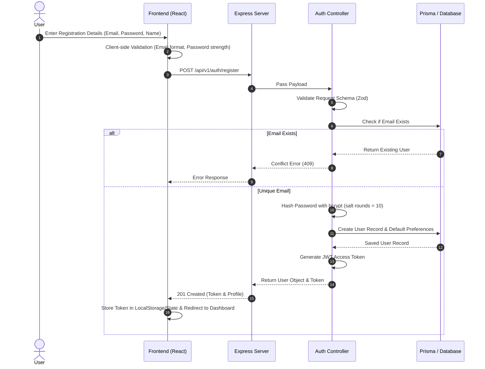
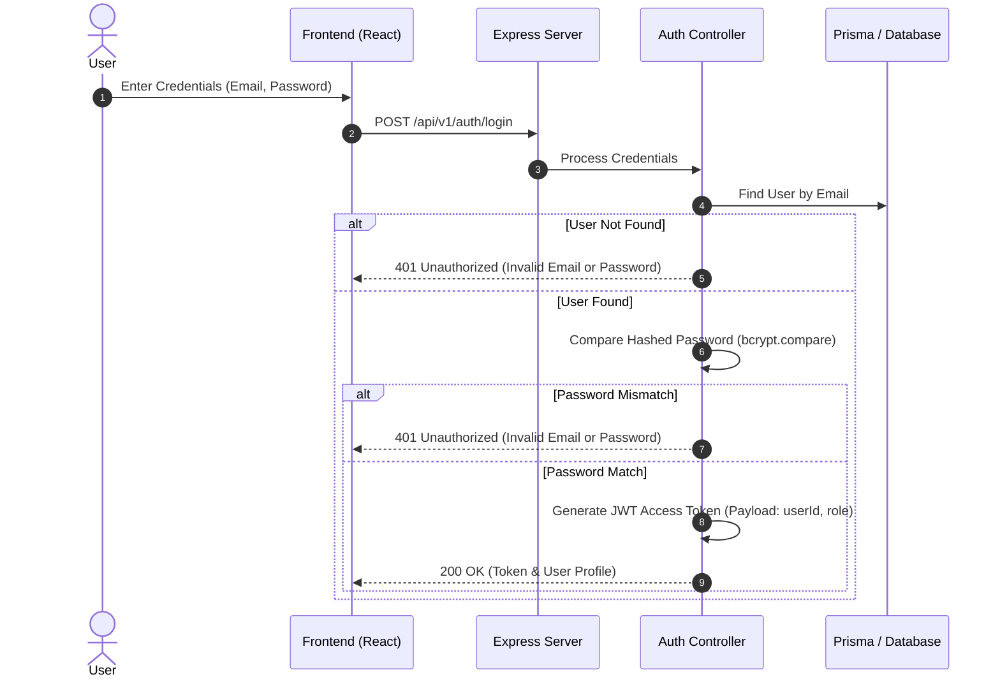

# Authentication & Authorization Architecture

## 1. Overview

The GlobeTrotter Authentication and Authorization system ensures secure user access, identity verification, session management, and resource protection across the platform.

The system uses JSON Web Tokens (JWT) for stateless authentication and Role/Ownership-Based Access Control (RBAC/OBAC) for resource authorization.

---

## 2. Authentication Flow

### 2.1 Registration Flow

### 2.2 Login Flow

---

## 3. JWT Token Specification

### Token Structure

- **Header**: `{"alg": "HS256", "typ": "JWT"}`
- **Payload**:
  - `sub`: `userId` (UUID string)
  - `email`: User email address
  - `role`: `USER` | `ADMIN`
  - `iat`: Issued at timestamp
  - `exp`: Expiration timestamp (Default: 7 days)
- **Signature**: `HMACSHA256(base64UrlEncode(header) + "." + base64UrlEncode(payload), JWT_SECRET)`

---

## 4. Authorization System

### 4.1 Middlewares

1. **`authMiddleware`**:

   - Extracts Token from header: `Authorization: Bearer <token>`
   - Verifies JWT signature against `JWT_SECRET`.
   - Attaches `req.user = { userId, role, email }` to request context.
   - Returns `401 Unauthorized` if token is missing, invalid, or expired.
2. **`adminMiddleware`**:

   - Assumes `authMiddleware` ran first.
   - Verifies `req.user.role === 'ADMIN'`.
   - Returns `403 Forbidden` if user is not an administrator.
3. **Ownership Verification (OBAC)**:

   - For private resources (Trips, Itinerary Items, Expenses), the controller/service verifies `resource.userId === req.user.userId`.
   - Returns `403 Forbidden` if the resource does not belong to the user.

---

## 5. Security Best Practices

- **Password Storage**: Passwords are never stored in plain text. Always hashed using `bcrypt` (10 rounds).
- **Sensitive Fields Exclusion**: Password hashes are stripped from all API response JSON objects.
- **Input Sanitation & Validation**: All incoming auth payloads are validated using `Zod` schemas.
- **CORS Protection**: Access restricted to configured origins (`CORS_ORIGIN`).
- **Rate Limiting**: Auth endpoints (`/login`, `/register`, `/forgot-password`) enforce IP-based rate limiting to protect against brute-force attacks.
